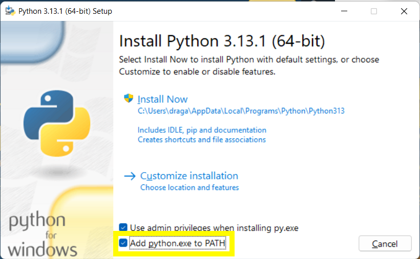
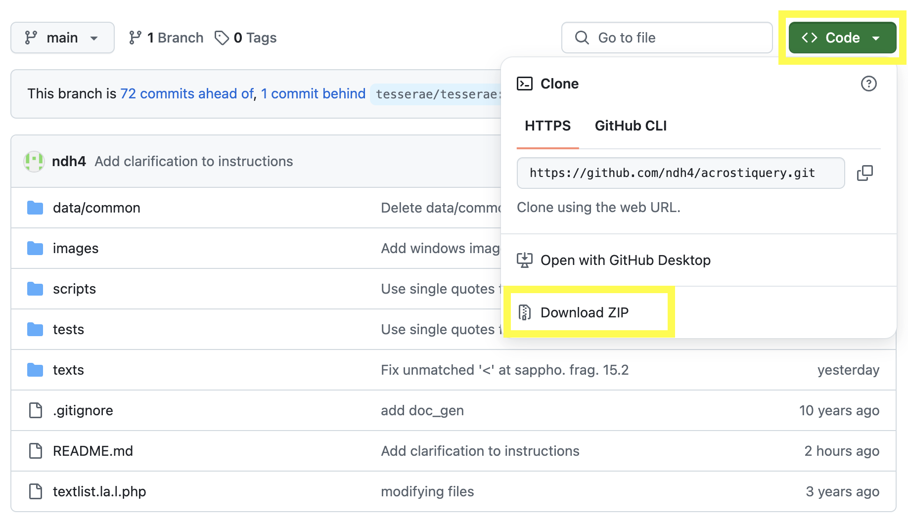
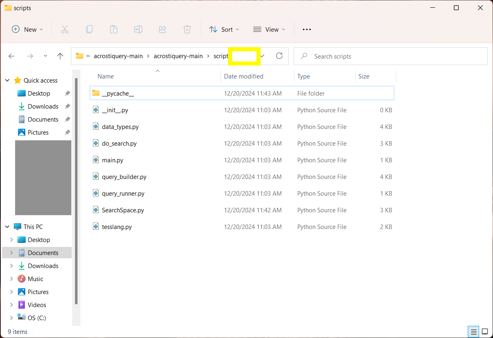
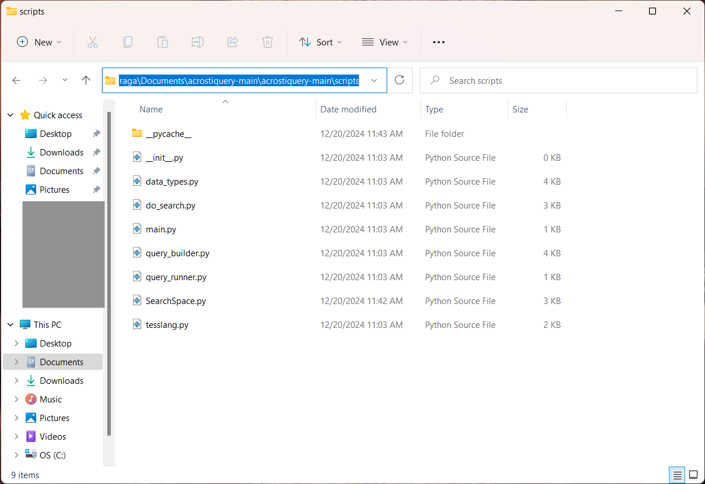
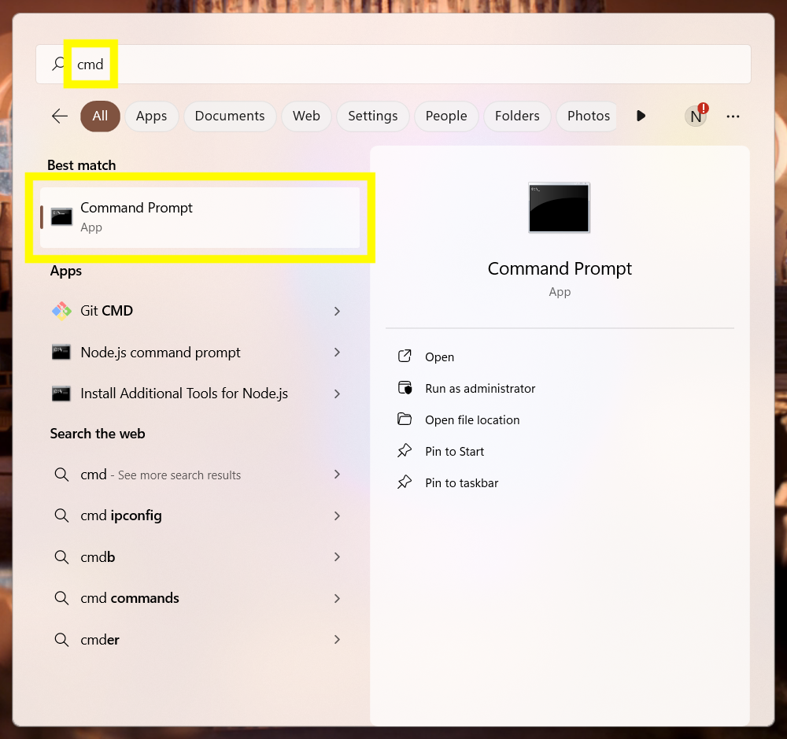
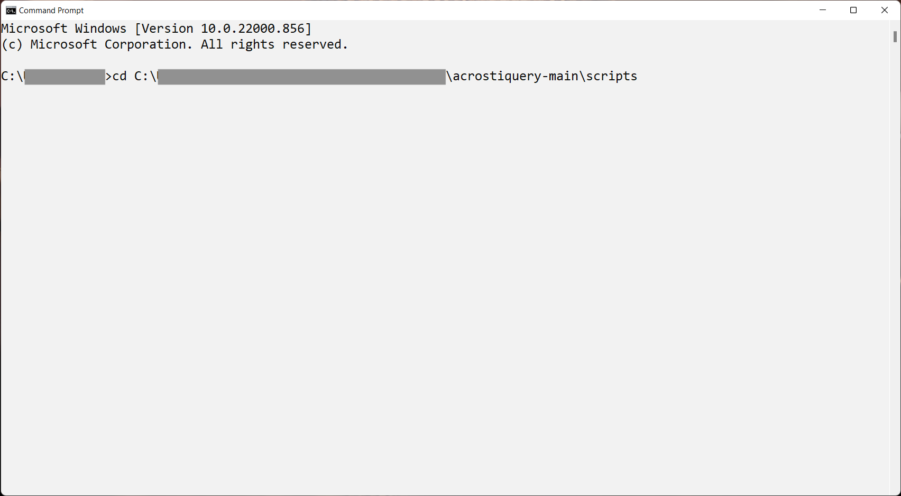
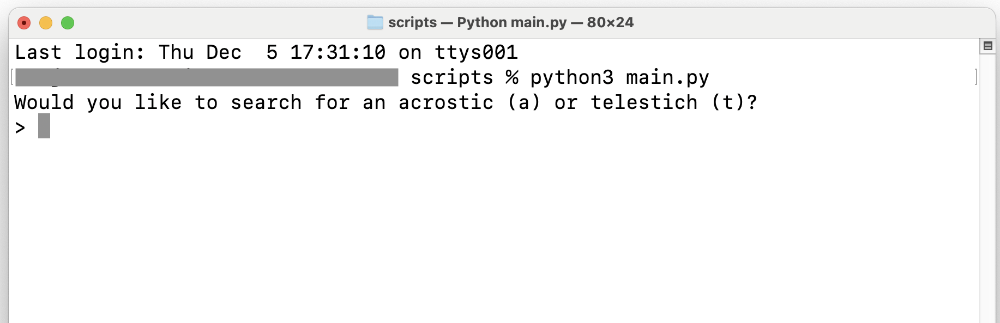

# Instructions

### Install python

1. Go to [python.org/downloads/](https://www.python.org/downloads/) and download the latest version.
2. Open the downloaded `pkg` or `exe` file and follow the installer's instructions to complete installation. On Windows, make sure that "Add python.exe to PATH" is selected. 

### Run acrostiquery

1. Go to [github.com/ndh4/acrostiquery](https://github.com/ndh4/acrostiquery) and click on the green box that says `<> Code`. Then click `Download ZIP`.

2. Unzip and open the downloaded folder.
3. Open a terminal inside `scripts`:
   1. Here's how to do that on Mac:
      1. Right-click on `scripts`.
      2. Select "New Terminal at Folder" 
   2. Here's how to do it on Windows:
      1. Open the `scripts` folder.
      2. Click on the address bar at the top of the window.  
      3. Use <kbd>CTRL</kbd> + <kbd>c</kbd> to copy the contents of the address bar.
      4. Open Windows Search (AKA the Start Menu) and search for `cmd`. Open the first thing that comes up (probably called `Command Prompt`). 
      5. Type the letters `cd` and hit the <kbd>Space</kbd> bar, then use <kbd>CTRL</kbd> + <kbd>v</kbd> to paste the address you copied earlier. 
      6. Hit the <kbd>Enter</kbd> key.
4. Type `python3 main.py` and hit enter.
   1. If that doesn't work ("Python was not found/recognized"), try `py main.py`.
   2. If that doesn't work, try `python main.py`.
   3. If that doesn't work, try `py3 main.py`.
5. Answer the prompts that follow. The first prompt should be the question shown below.

