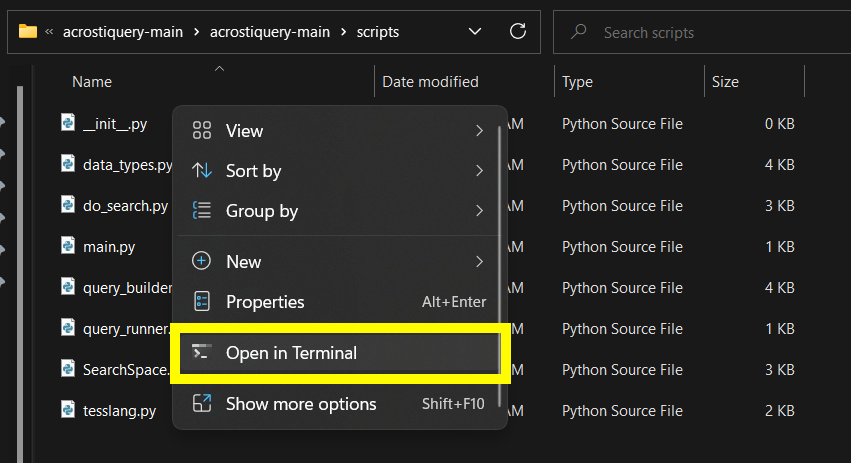

# Instructions

### Install python

1. Go to [python.org/downloads/](https://www.python.org/downloads/) and download the latest version.
2. Open the downloaded `pkg` or `exe` file and follow the installer's instructions to complete installation. On Windows, make sure that "Add python.exe to PATH" is selected. 

### Run acrostiquery

1. Go to [github.com/ndh4/acrostiquery](https://github.com/ndh4/acrostiquery) and click on the green box that says `<> Code`. Then click on `Download ZIP`.

2. Unzip the file and open the resulting folder.
3. Open a terminal in `scripts`:
   1. On Mac, right-click on `scripts` and select "New Terminal at Folder" 
   2. On Windows, go to `scripts` folder, then right click and select `Open in Terminal` 
4. In the window that opens, type `python3 main.py` and hit enter.
   1. If that doesn't work, try `py main.py`.
   2. If that doesn't work, try `python main.py`.
   3. If that doesn't work, try `py3 main.py`.
5. Answer the prompts that follow.

