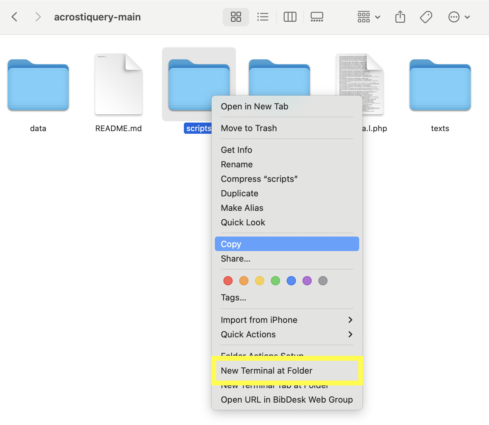

# Instructions

### Install python

1. Go to [python.org/downloads/](https://www.python.org/downloads/) and download the latest version.
2. If that doesn't end up working, download version 3.13.1 instead.

### Run acrostiquery

1. Code | Download ZIP.

2. Unzip the file.
3. Open a new terminal at the "scripts" folder using the following method.
   1. On Mac: 
   2. On Windows: FIXME
4. In the window that opens, type `python3 main.py` and hit enter.
5. Answer the questions that follow.

